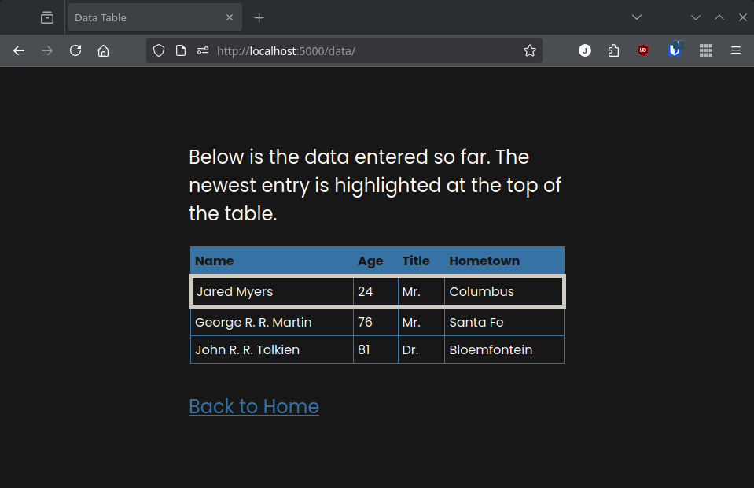

# Data-Entry-Web-Application-Exercise
A simple data entry web application

This application was developed with Python 3.13.5.

## Getting Started
Prior to downloading any code from this repository, it is important that you have Python installed on your computer. There are instructions to do so [here](https://wiki.python.org/moin/BeginnersGuide/Download).

There are some differences to be aware of between operating systems. On Windows systems, Python can usually be invoked with the `py` command, whereas on MacOS and Linux you typically use `python` or even `python3`. In systems with multiple Python installations, you may even need to specify the exact version. This guide uses the Linux command style, referring to Python with `python` and making use of forward slashes (/) in the command line. Some Windows commands are provided, but only in the steps which have explicit differences between operating systems. **If a command does not work for you, make sure you have made any necessary adjustments for your operating system.** 

To begin working with this code, clone this repository to your local machine. In the git command line interface, the following command would achieve this goal:
```
git clone https://github.com/myers3jm/Data-Entry-Web-Application-Exercise.git
```

Once the repository is cloned locally, navigate within the `Data-Entry-Web-Application-Exercise` directory within your command line interface.


The next step is to create your Python virtual environment. To begin, run the command
```
python -m venv ./.venv
```

After running this command, there should be a new directory present in within the downloaded code repository.


Next, the virtual environment needs to be "activated." This just means the command line interface will use the miniature Python we just made instead of the system-wide version.

This step varies depending on your operating system. On Linux and MacOS, the following command activates the virtual environment:
```
source ./.venv/bin/activate
```

On Windows, there are a couple of options. If you are using `cmd.exe` as your command line interface, run this command:
```
\.venv\Scripts\activate.bat
```

If you are using PowerShell run this command:
```
\.venv\Scripts\Activate.ps1
```

Now that the Python virtual environment is activated, we can install the dependencies for this project. This is achieved with the following command:
```
python -m pip install -r requirements.txt
```

This command pulls all of the required dependencies from the internet and installs them within the Python virtual environment.

With the dependencies installed, we can now create the database this web application uses. Simply run
```
python create_db.py
```

and the database will be built. You can verify that this has occurred by observing the `instance` directory which is made, and inside that directory is the database file `database.db`.


That completes all the necessary setup! To run the web application, just run
```
python api.py
```

You will see some text in the command line interface that should look similar to this screenshot:


The warnings can be ignored, as this is not a production environment. You are now running the web application, and can begin using it in the web browser. Navigate to `http://127.0.0.1:5000/` to access the web application.


When you have entered data into the fields, click "Submit" and you will see all previously-entered data, with the addition of your new submission.


## Interaction via API
This web application provides an API layer. The API provides two endpoints: `/api/submit` and `/api/data/`.

### The `/api/submit/` Endpoint
This endpoint accepts HTTP POST requests and is used to enter data into the database. Below is a sample request which will be accepted by the API:
```
{"name": "Jared", "age": 24, "title":"Mr.", "hometown":"Columbus"}
```
In the event of a bad request, the server will issue `HTTP 400 - Bad Request` and a list of the errors with the request:
```
{"name": "", "age": -3, "title":"", "hometown":"Columbus"}
```
```
{
	"errors": [
		"Invalid name provided. Acceptable values are nonzero-length strings.",
		"Invalid age provided. Acceptable values are whole numbers 1-150 inclusive. This field can also be left blank.",
		"Invalid title provided. Acceptable values are nonzero-length strings"
	]
}
```

### The `/api/data/` Endpoint
This endpoint accepts HTTP GET requests and is used to view data in the database. Below is a sample response from the server to a standard HTTP GET request:
```
[
	{
		"id": 3,
		"name": "Jared M",
		"age": 24,
		"title": "Mr.",
		"hometown": "Columbus"
	},
	{
		"id": 2,
		"name": "George R. R. Martin",
		"age": 76,
		"title": "Mr.",
		"hometown": "Santa Fe"
	},
	{
		"id": 1,
		"name": "John R. R. Tolkien",
		"age": 81,
		"title": "Dr.",
		"hometown": "Bloemfontein"
	}
]
```